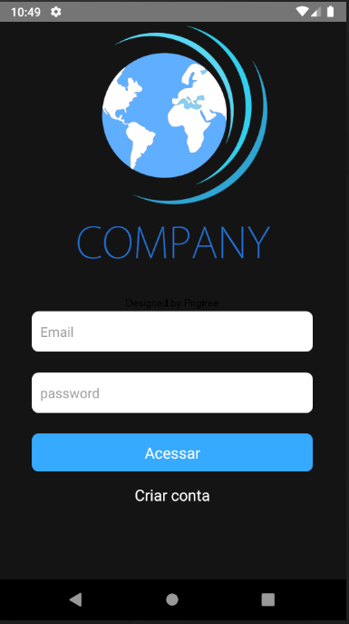
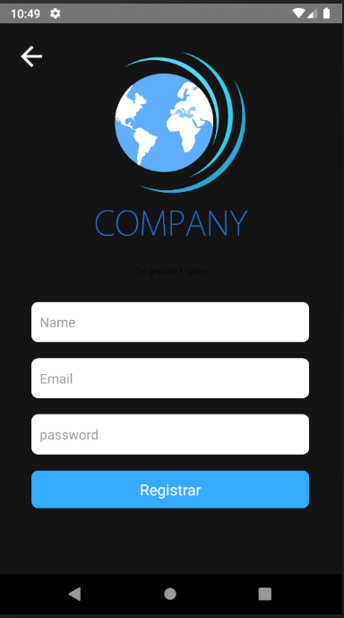

### Aplicativo feito Para vaga de desenvolvedor React-Native

### Front-end/Mobile Software Test




---
### Aplicativo Possue Autenticação com API JWT

#### Login Complemente funcional

### Tecnologias Utilizadass

- React Native
- Context-api
- Axios
- Animated
- React Hooks
- Typescript
- React Navigation V5
- Styled-Components
- React-native-vector-icons
- Formik
- Yup
---
### How to run

#### First Need Enviroment Setup

#### Follow this guide (open React Native CLI Quickstart)
[React-native Enviroment Setup](https://reactnative.dev/docs/environment-setup 'site')

After the Setup

#### Open the project root directory and run command

``` 
npm install
```
or

```
yarn install
```
Run on device or emulator

```
npx react-native run-android
```
